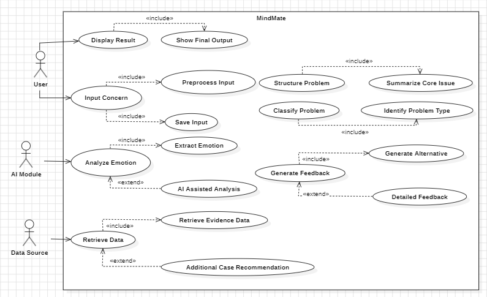
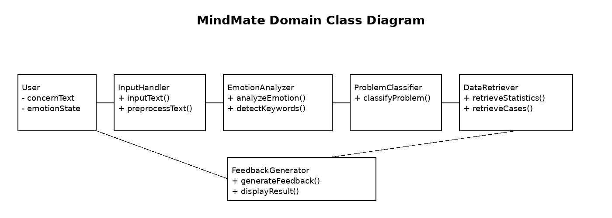
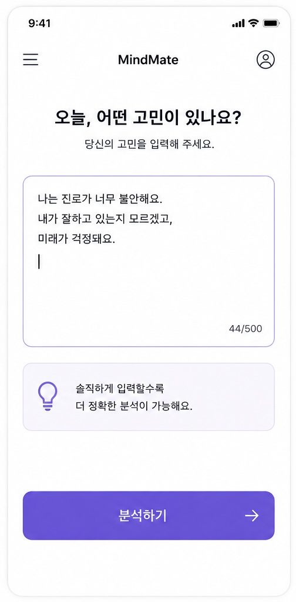
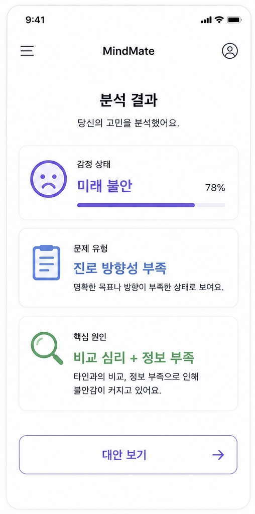
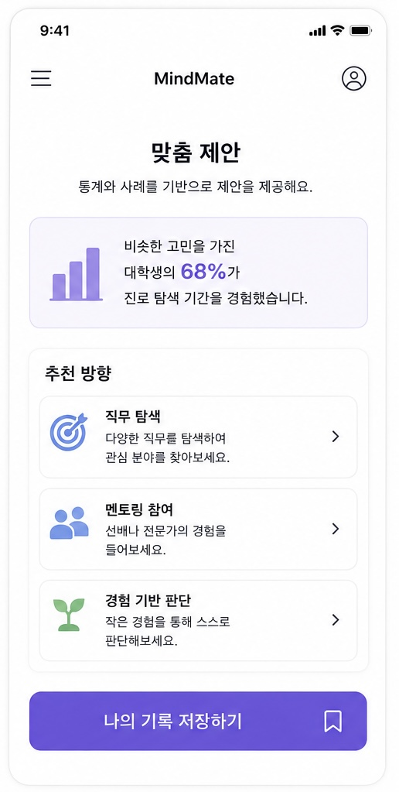

# 1. Analysis

## Revision History

| Revision date | Version # | Description | Author |
|---------------|-----------|-------------|--------|
|  2026-03-27   |  0.0.1    | 개념화 문서 작성 완료 | 김민석 |
|  2026-05-08   |  0.0.2    | 분석 문서 작성 완료   | 김민석 |
|               |           |             |        |

---

## Contents

1. Introduction
2. Use Case Analysis
3. Domain Analysis
4. Functional Decisions
5. User Interface Prototype
6. Glossary
7. References

---

## 1. Introduction

### 1) Summary

학생들은 제한된 경험과 환경 속에서 미래에 대한 막연한 불안과 방향성의 혼란을 자주 경험한다.
특히 중·고등학생과 대학생은 진로, 비교, 학업, 인간관계 등 다양한 문제 속에서 자신의 현재 상태를 객관적으로 판단하기 어려워하며, 이러한 불안은 장기적인 심리적 불안정으로 이어질 수 있다.

기존의 상담 시스템은 감정적인 위로 중심의 접근이 많고, 상담 접근성이나 비용, 시간적인 한계로 인해 많은 학생들이 쉽게 도움을 받기 어렵다. 또한 사용자가 자신의 문제를 구조적으로 이해하고 현실적인 방향성을 설정할 수 있도록 돕는 시스템은 부족한 상황이다.

이에 따라 MindMate는 사용자의 고민을 자연어로 입력받아 감정을 분석하고, 문제를 분류 및 구조화한 뒤, 통계 및 사례 데이터를 기반으로 객관적인 정보를 제공하는 규칙 기반 분석 및 AI 보조 상담 지원 시스템이다.

본 시스템은 직접적인 해결책을 제시하거나 사용자의 의사결정을 대신하는 것이 아니라, 현실적인 데이터를 기반으로 다양한 가능성과 대안을 보여주는 역할에 초점을 둔다. 이를 통해 사용자가 스스로 자신의 상황을 객관적으로 이해하고, 더 합리적인 판단을 내릴 수 있도록 지원하는 것을 목표로 한다. 이를 통해 객관적인 데이터를 기반으로 사용자의 판단을 지원한다.

즉, MindMate는 단순한 상담 챗봇이 아닌, 학생들의 불안을 줄이고 방향 설정을 돕는 의사결정 지원 시스템 (Decision Support System) 으로 설계된다.

### 2) Describe the Features of Project

- **자연어 입력:** 사용자는 자신의 고민, 불안, 감정을 자연어 형태로 자유롭게 입력할 수 있다.
- **감정 분석:** 입력된 텍스트를 기반으로 불안, 비교, 스트레스, 진로 고민 등의 감정 상태를 분석한다.
- **문제 유형 분류:** 감정 분석 결과를 바탕으로 문제 유형을 분류하고 핵심 원인을 식별한다.
- **문제 구조화:** 복잡한 고민을 구조화하여 사용자가 자신의 문제를 명확하게 이해할 수 있도록 정리한다.
- **데이터 조회:** 문제 유형에 맞는 통계 및 사례 데이터를 조회하여 객관적인 근거를 확보한다.
- **근거 기반 대안 제시:** 직접적인 정답을 제시하는 것이 아니라, 통계 및 사례 기반으로 현실적인 선택지와 대안을 제공한다.
- **결과 통합:** 최종적으로 모든 정보를 통합하여 사용자에게 이해하기 쉬운 형태로 결과를 제공한다.

---

## 2. Use Case Analysis

### 1) Use Case Diagram

- **Actors:** User(Student), AI Module, Data Source
- **Core Use Case:** Input Concern.  Analyze Emotion, Classify Problem,  Structure Problem, Retrieve Data, Generate Feedback, Display Result
- **Relationship Rules:** 항상 수행되는 하위 단계는 `<<include>>`, 조건부 발생은 `<<extend>>`

### 2)  Use Case Description

#### Use Case #1 : Input Concern

- **Summary:** 사용자가 자신의 고민, 불안, 감정 상태를 자연어 형태로 자유롭게 입력하는 기능
- **Primary Actor:** User
- **Preconditions:** 시스템 접속 가능 상태, 사용자 입력 화면 진입 완료
- **Main Success Scenario:**
  1. 사용자가 현재 자신의 고민이나 불안을 텍스트로 입력한다.
  2. 시스템은 입력된 내용을 저장하고 전처리를 수행한다.
  3. 불필요한 특수문자 및 중복 표현을 제거한다.
  4. 감정 분석 단계로 자동 전환된다.

#### Use Case #2 : Analyze Emotion

- **Summary:** 사용자의 입력 내용을 기반으로 감정 상태를 분석하는 기능
- **Primary Actor:** AI Module
- **Preconditions:** 사용자의 고민 입력 완료
- **Main Success Scenario:**
  1. 시스템은 입력된 텍스트를 분석한다.
  2. 불안, 스트레스, 비교 심리, 진로 고민 등의 감정 키워드를 탐지한다.
  3. 감정 상태를 분류하고 우선순위를 설정한다.
  4. 문제 유형 분류 단계로 이동한다.

#### Use  Case #3 : Generate Feedback

- **Summary:** 분석 결과와 통계 데이터를 기반으로 현실적인 대안과 방향성을 제공하는 기능
- **Primary Actor:** AI Module
- **Preconditions:** 감정 분석 및 문제 유형 분류 완료
- **Main Success Scenario:**
  1. 시스템은 문제 유형에 맞는 통계 및 사례 데이터를 조회한다.
  2. 유사한 고민 사례와 객관적인 근거를 수집한다.
  3. 직접적인 정답이 아닌 현실적인 선택지와 방향성을 생성한다.
  4. 사용자에게 최종 결과 화면을 제공한다.
  
---

## 3. Domain Analysis

### 1) Domain class diagram

### 2) Description of domain classes

| Class Name            | Description                    | Attributes (Public)                  |
| --------------------- | ------------------------------ | ------------------------------------ |
| **User**              | 시스템 사용자 및 고민 입력의 주체            | `concernText`, `emotionState`        |
| **InputHandler**      | 사용자의 입력을 수집하고 전처리하는 클래스        | `inputText`, `processedText`         |
| **EmotionAnalyzer**   | 입력된 텍스트를 기반으로 감정을 분석하는 클래스     | `emotionType`, `emotionScore`     |
| **ProblemClassifier** | 감정 분석 결과를 바탕으로 문제 유형을 분류하는 클래스 | `problemCategory`, `problemLevel`    |
| **DataRetriever**     | 통계 및 사례 데이터를 조회하는 클래스          | `statisticsData`, `caseData`         |
| **FeedbackGenerator** | 최종 피드백과 대안을 생성하는 클래스           | `feedbackText`, `alternativeOptions` |

---

## 4. Functional Decisions

### 1) Emotion Analysis Method

본 시스템은 키워드 기반 감정 분석을 기본으로 하며, 필요에 따라 AI Module을 활용하여 분석 정확도를 보완한다.

초기 구현 단계에서는 Java 환경에서 안정적으로 구현 가능한 규칙 기반 분석 방식을 사용하며, 사용자가 입력한 문장에서 불안, 비교, 스트레스, 진로 고민 등의 핵심 감정 키워드를 탐지한다.

이 방식은 구현이 단순하고 분석 과정이 명확하여 유지보수가 용이하며, AI는 모호한 표현이나 복합적인 감정 분석을 보조하는 역할로 제한한다.

### 2) Data Retrieval Method

문제 유형이 분류된 이후, 해당 유형에 맞는 통계 및 사례 데이터를 조회하는 방식으로 시스템을 설계한다.

예를 들어 사용자의 고민이 “진로 불안”으로 분류될 경우, 관련 청소년 통계, 진로 고민 사례, 유사 상황의 해결 방향 등을 검색하여 객관적인 근거를 제공한다.

이를 통해 단순한 감정적 위로가 아닌, 현실적인 데이터 기반 판단을 지원할 수 있다.

### 3) Feedback Generation Method

최종 피드백은 규칙 기반 응답과 데이터 기반 대안 제시 방식으로 생성한다.

본 시스템은 사용자의 의사결정을 대신하거나 정답을 제시하지 않으며, 통계 및 사례를 기반으로 현실적인 선택지와 방향성을 제공하는 역할에 집중한다.

이는 AI 상담 시스템에서 발생할 수 있는 윤리적 문제를 줄이고, 사용자가 스스로 합리적인 판단을 내릴 수 있도록 돕기 위한 설계이다.

---

## 5. User Interface Prototype

### 1) UI Flow Diagram

고민 입력 
→ 입력 전처리
→ 감정 분석 
→ 문제 유형 분류 
→ 문제 구조화 
→ 통계 및 사례 조회 
→ 현실적 대안 생성 
→ 최종 결과 출력

본 시스템은 사용자의 고민 입력부터 최종 결과 제공까지 순차적인 흐름으로 동작하며, 각 단계는 이전 단계의 분석 결과를 기반으로 진행된다.

### 2) Screen Prototypes  Description

- **Screen 1: Input Concern**

  - 사용자가 자신의 고민이나 불안을 자유롭게 입력하는 화면이다.
  - 직관적인 입력창과 간단한 안내 문구를 제공하여 누구나 쉽게 사용할 수 있도록 설계한다.
  - 예를 들어 학업, 진로, 인간관계, 비교 불안 등 다양한 고민을 자연어 형태로 입력할 수 있다.

---

- **Screen 2: Emotional Analysis Result**

  - 입력된 텍스트를 분석한 결과를 사용자에게 제공하는 화면이다.
  - 감정 상태, 문제 유형, 핵심 원인을 시각적으로 정리하여 사용자가 자신의 현재 상태를 객관적으로 이해할 수 있도록 지원한다.
  - 예를 들어 “미래 불안”, “진로 방향성 부족”, “비교 심리” 등의 분석 결과가 제공된다.

---

- **Screen 3: Final Feedback**

  - 통계 및 사례 데이터를 기반으로 현실적인 대안과 방향성을 제공하는 화면이다.
  - 본 시스템은 직접적인 정답을 제시하지 않고, 다양한 선택지와 객관적인 근거를 함께 제공하여 사용자의 합리적인 의사결정을 지원한다.
  - 예를 들어 유사 사례 통계, 행동 추천, 참고 가능한 방향성 등이 포함된다.

---

## 6. Glossary

| Term                              | Description                              |
| --------------------------------- | ---------------------------------------- |
| Emotion Analysis                  | 사용자가 입력한 텍스트를 기반으로 감정 상태를 분석하는 과정        |
| Problem Classification            | 감정 분석 결과를 바탕으로 문제 유형을 분류하는 과정            |
| Problem Structuring               | 사용자의 고민을 구조적으로 정리하여 핵심 원인을 파악하는 과정       |
| Data Retrieval                    | 문제 유형에 맞는 통계 및 사례 데이터를 조회하는 과정           |
| Evidence-based Alternative        | 객관적인 데이터와 사례를 기반으로 현실적인 선택지와 대안을 제공하는 방식 |
| NLP (Natural Language Processing) | 자연어 처리 기술로, 사용자의 자유로운 텍스트 입력을 분석하는 기술    |
| User Input                        | 사용자가 시스템에 입력하는 고민, 감정, 상황에 대한 텍스트 데이터    |
| AI Module                         | 감정 분석 및 자연스러운 피드백 생성을 보조하는 인공지능 모듈       |
| Decision Support System           | 사용자의 의사결정을 대신하지 않고 판단을 지원하는 시스템          |

---

## 7. References

## 국내 자료

1. **Statistics Korea (KOSIS)**   
https://kosis.kr
> 청소년 자살률, 사망 원인, 정신건강 관련 통계 제공

2. Korea Disease Control and Prevention Agency (KDCA)   
https://www.kdca.go.kr
> 청소년 건강행태조사 및 우울감 경험률 자료 제공

3. Korea Youth Counseling & Welfare Institute (KYCI)
https://www.kyci.or.kr
> 청소년 상담 사례 및 상담 지원 정책 자료 제공

4. National Youth Policy Institute (NYPI)   
https://www.nypi.re.kr
> 청소년 진로 고민, 불안, 정신건강 관련 연구 자료 제공

---

## 해외 연구

5. Adolescent Depression Prediction using Machine Learning   
https://www.nature.com/articles/s41598-024-72158-9
> 머신러닝 기반 청소년 우울 예측 가능성 연구

6. AI-Based Digital Therapeutics for Adolescent Mental Health   
https://www.mdpi.com/2078-2489/15/10/620
> AI 기반 디지털 치료 및 상담 시스템 효과 검증

7. NLP Chatbot for Mental Health Detection   
https://www.mdpi.com/2673-4591/107/1/64
> 자연어 처리 기반 감정 분석 및 상담 챗봇 기술 연구

8. Decision Support Systems for Mental Health Applications   
https://www.sciencedirect.com
> 의사결정 지원 시스템의 개념 및 정신건강 분야 적용 사례 연구
