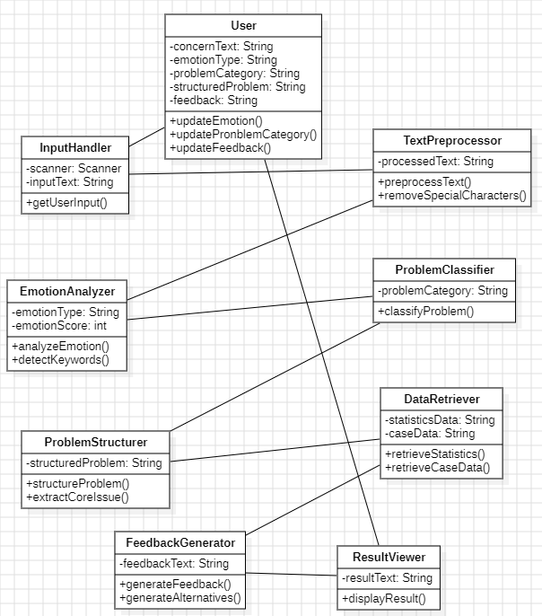
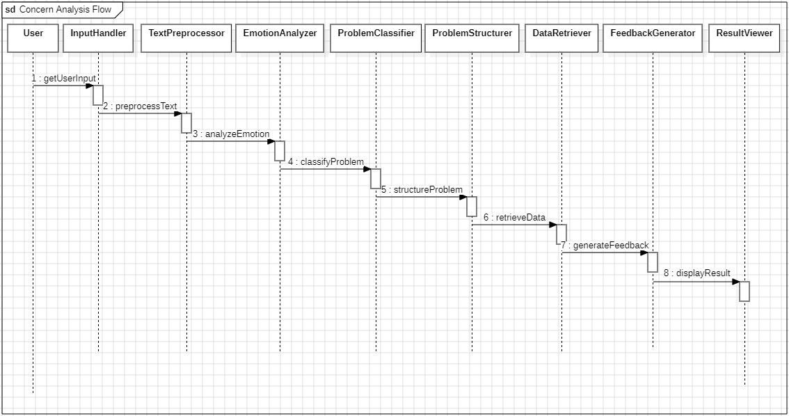
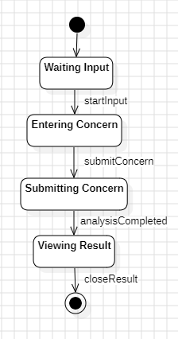
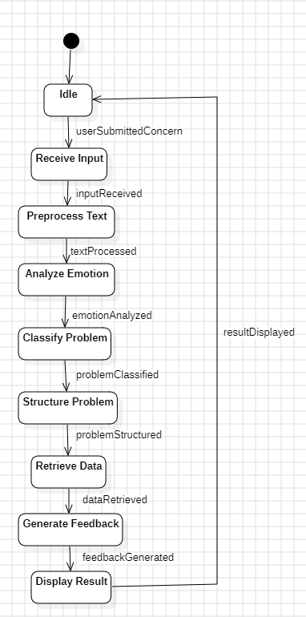

# 1.  Design

## Revision History

| Revision date | Version # | Description | Author |
| ------------- | --------- | ----------- | ------ |
|  2026-06-02   |   3.0.0   | 설계 문서 작성 완료 | 김민석 |
|  2026-06-12   |   3.0.1   | 구현 이후 분석 문서 재작성 | 김민석 |
|               |           |             |        |
|               |           |             |        |

---

## Contents

1. Introduction
2. Class diagram
3. Sequence diagram
4. State machine diagram
5. Implementation requirements
6. Glossary
7. References

---

## 1. Introduction

### 1) Overview

MindMate는 학생들이 경험하는 미래 불안, 진로 고민, 비교 심리, 학업 스트레스, 인간관계 등의 문제를 객관적으로 이해하고 현실적인 방향성을
탐색할 수 있도록 지원하는 의사결정 지원 시스템(Decision Support System)이다.

본 시스템은 사용자가 입력한 고민을 분석하여 감정 상태와 문제 유형을 파악하고, 이를 구조적으로 정리한 후 통계 및 사례 데이터를 기반으로
현실적인 선택지와 대안을 제공한다. MindMate는 사용자의 의사결정을 대신하지 않으며, 객관적인 정보와 근거를 제공함으로써 사용자가
스스로 판단할 수 있도록 지원하는 것을 목표로 한다.

---

### 2) Design Objectives

본 설계 문서는 MindMate 시스템의 내부 구조와 동작 방식을 정의하기 위해 작성되었다.

시스템은 객체지향 설계(Object-Oriented Design)를 기반으로 구성되며,
각 기능을 독립적인 클래스로 분리하여 유지보수성과 확장성을 확보한다.

특히 다음과 같은 설계 원칙을 적용한다.
 - 단일 책임 원칙(Single Responsibility Principle)을 적용하여 각 클래스가 하나의 역할만 수행하도록 설계한다.
 - 감정 분석, 문제 분류, 데이터 조회, 피드백 생성 기능을 분리하여 모듈화한다.
 - 규칙 기반 감정 분석을 기본 구조로 사용하고 AI 모듈은 보조 기능으로 제한한다.
 - 통계 및 사례 데이터를 활용하여 객관적인 근거를 제공한다.
 - 사용자의 의사결정을 대신하지 않고 현실적인 선택지와 방향성을 제공한다.

---

### 3) System Design Overview

MindMate는 사용자의 자연어 입력을 기반으로 고민 분석과 간단 의사결정을 지원하는 Spring Boot 기반 웹 애플리케이션으로 설계된다.

시스템은 사용자가 웹 브라우저를 통해 고민이나 선택 상황을 입력하면, 이를 서버에서 분석하고 최종 결과를 웹 화면에 제공하는 방식으로 동작한다.

전체 처리 흐름은 다음과 같다.

User -> Web User Interface -> PageController -> EmotionAnalyzer -> Gemini API or Fallback Mode -> ProblemStructurer -> DataRetriever -> FeedbackGenerator -> ResultViewer

사용자가 입력한 텍스트는 Controller를 통해 분석 서비스로 전달된다.
EmotionAnalyzer는 외부 AI API를 활용하여 감정 분석과 문제 분석을 수행하며, AI API 사용이 불가능한 경우에는 내부 규칙 기반 Fallback Mode를 통해 기본 분석 결과를 생성한다.

이후 ProblemStructurer는 AI 응답 또는 내부 분석 결과를 감정 분석, 문제 유형, 핵심 원인, 객관적 관점, 현실적인 대안으로 구조화한다.
DataRetriever는 문제 유형에 맞는 통계 및 사례 데이터를 조회하고, FeedbackGenerator는 분석 결과와 근거 데이터를 통합하여 최종 피드백을 생성한다.

최종 결과는 웹 화면에서 카드 형태로 제공되며, 사용자는 자신의 고민이나 선택 상황을 구조적으로 확인할 수 있다.

---

### 4) Important Design Decisions

본 시스템은 외부 AI API에만 의존하지 않고, 내부 규칙 기반 분석 구조를 함께 포함하도록 설계하였다.

외부 AI API를 사용할 수 있는 경우에는 Gemini API를 활용하여 자연어 기반 감정 분석과 피드백 생성을 수행한다.
그러나 외부 AI API는 요청 한도 초과, 서버 오류, 네트워크 문제 등으로 인해 항상 안정적으로 응답하지 못할 수 있다.

이를 고려하여 MindMate는 AI API 호출 실패 시 내부 키워드 기반 Fallback Mode로 전환되도록 설계하였다.
이 구조를 통해 외부 AI 서비스가 일시적으로 불안정하더라도 시스템 전체가 중단되지 않고, 사용자에게 기본적인 분석 결과를 계속 제공할 수 있다.

또한 본 시스템은 사용자의 의사결정을 대신하지 않는 것을 핵심 원칙으로 한다.
감정 분석, 문제 분류, 데이터 조회, 피드백 생성 기능을 분리하여 각 기능이 독립적으로 동작하도록 설계하였으며, 이를 통해 유지보수성과 확장성을 확보하였다.

최종 구현은 콘솔 기반 프로그램이 아니라 Spring Boot와 Thymeleaf를 활용한 웹 애플리케이션 형태로 구성하였다.
사용자는 웹 브라우저를 통해 고민 분석, 간단 의사결정, 개인정보 안내, 분석 결과 확인 기능을 이용할 수 있다.

---

## 2. Class Diagram

### 1) Class Diagram Overview

MindMate는 사용자의 고민을 입력받아 감정 분석, 문제 분류, 문제 구조화, 데이터 조회 및 피드백 생성을 수행하는 객체지향 기반 시스템이다.

시스템은 각 기능을 독립적인 클래스로 분리하여 유지보수성과 확장성을 높였으며, 각 클래스는 단일 책임 원칙(SRP)을 기반으로
하나의 역할을 수행하도록 설계하였다.

본 시스템은 User 객체를 중심으로 동작하며, 입력부터 최종 결과 출력까지 단계별 처리 클래스를 통해 데이터를 가공하고 분석한다.

---

### 2) Class Description

아래의 그림은 시스템의 Class Diagram을 표현한 그림이다.

---

아래의 표와 내용은 위의 Class Diagram에서 표현한 Class들의 설명이다.

|    Class Name     | Description | Key Attributes |
| ----------------- | ----------- | -------------- |
| User              | 사용자의 고민과 분석 결과를 저장하는 핵심 객체 | concernText, emotionType, problemCategory, structuredProblem, feedback |
| InputHandler      | 사용자의 고민 입력을 수집 | inputText |
| TextPreprocessor  | 입력된 텍스트를 정제 | processedText |
| EmotionAnalyzer  |  감정 상태 분석 수행 | emotionType, emotionScore |
| ProblemClassifier | 문제 유형 분류 | problemCategory |
| ProblemStructurer | 문제를 구조적으로 정리 | structuredProblem |
| DataRetriever     | 통계 및 사례 데이터 조회 | statisticsData, caseData |
| FeedbackGenerator | 현실적인 대안 및 피드백 생성 | feedbackText |
| ResultViewer      | 최종 결과 출력 |  resultText |

---

### User

사용자가 입력한 고민과 시스템이 생성한 모든 분석 결과를 저장하는 핵심 클래스이다.

본 클래스는 시스템 전체에서 공유되는 데이터 객체로 사용되며, 고민 내용(concernText), 감정 분석 결과(emotionType), 문제 유형(problemCategory), 구조화된 문제 정보(structuredProblem), 최종 피드백(feedback)을 저장한다.

각 분석 단계는 User 객체에 저장된 정보를 참조하거나 갱신하며, 최종 결과 또한 User 객체를 통해 관리된다.

---

### InputHandler

사용자로부터 고민 내용을 입력받는 역할을 수행하는 클래스이다.

사용자가 입력한 자연어 형태의 고민을 수집하여 시스템 내부 처리 과정으로 전달하며, 사용자와 시스템 사이의 첫 번째 인터페이스 역할을 담당한다.

본 클래스는 입력 기능만 수행하며, 분석이나 데이터 처리 기능은 포함하지 않는다.

---

### TextPreprocessor

입력된 텍스트를 분석하기 적합한 형태로 정제하는 클래스이다.

사용자가 입력한 문장에 포함된 불필요한 특수문자, 중복, 공백, 불필요한 표현 등을 제거하여 이후 감정 분석 단계의 정확도를 향상시킨다.

전처리된 결과는 EmotionAnalyzer 클래스에 전달된다.

---

### EmotionAnalyzer

사용자가 입력한 고민을 분석하여 감정 상태를 식별하는 클래스이다.

규칙 기반 키워드 분석을 통해 불안, 스트레스, 비교 심리, 진로 고민 등의 감정을 탐지하여, 필요에 따라 AI 모듈을 보조적으로 활용할 수 있다.

분석 결과는 감정 유형(emotionType)과 감정 점수(emotionScore) 형태로 저장되며, 이후 문제 유형 분류 단계에서 활용된다.

---

### ProblemClassifier

감정 분석 결과를 바탕으로 문제 유형을 분류하는 클래스이다.

사용자의 고민을 진로 문제, 학업 문제, 인간관계 문제, 비교 불안 등으로 분류하며, 이후 단계에서 적절한 통계 자료와 사례 데이터를 조회하기 위한 기준 정보를 제공한다.

분류 결과는 User 객체에 저장된다.

---

### ProblemStructurer

분류된 문제를 사용자가 이해하기 쉬운 형태로 구조화하는 클래스이다.

복잡하게 얽혀 있는 고민을 핵심 원인과 주요 요소 중심으로 정리하여 사용자가 자신의 상황을 객관적으로 이해할 수 있도록 지원한다.

구조화된 결과는 DataRetriever 및 FeedbackGenerator 단계에서 활용된다.

---

### DataRetriever

문제 유형에 적합한 통계 자료와 사례 데이터를 조회하는 클래스이다.

사용자의 문제 유형에 따라 관련 통계, 연구 자료, 유사 사례 등을 검색하고 수집하여 객관적인 근거를 제공한다.

본 클래스는 시스템이 단순한 감정적 위로가 아닌 데이터 기반의 의사결정 지원 기능을 수행할 수 있도록 한다.

---

### FeedbackGenerator

분석 결과와 조회된 데이터를 기반으로 최종 피드백을 생성하는 클래스이다.

본 시스템은 사용자의 의사결정을 대신하지 않으며, 통계 자료와 사례 데이터를 근거로 현실적인 선택지와 방향성을 제공하는 것을 목표로 한다.

생성된 피드백은 최종 결과 화면에 출력될 수 있도록 정리된다.

---

### ResultViewer

시스템이 생성한 최종 결과를 사용자에게 출력하는 클래스이다.

감정 분석 결과, 문제 유형, 구조화된 문제 정보, 통계 자료, 사례 데이터 및 최종 피드백을 통합하여 사용자가 이해하기 쉬운 형태로 제공한다.

본 클래스는 사용자와 시스템 간의 마지막 인터페이스 역할을 담당하며, 분석 결과를 효과적으로 전달하는 역할을 수행한다.

---

## 3. Sequence Diagram

### 1) Concern Analysis and Feedback  Generation Flow

아래의 그림은 시스템의 Sequence diagram을 표현한 그림이다.

---

### 2) Sequence Diagram Explanation

사용자가 고민을 입력하면 InputHandler가 입력을 수집한다.
수집된 텍스트는 TextPreprocessor에서 전처리되며, EmotionAnalyzer가 감정 상태를 분석한다.

이후 ProblemClassifier가 문제 유형을 분류하고, ProblemStructurer가 문제를 구조적으로 정리한다.

DataRetriever는 관련 통계 및 사례 데이터를 조회하며, FeedbackGenerator는 이를 기반으로 현실적인 선택지와 방향성을 생성한다.

최종적으로 ResultViewer가 모든 결과를 통합하여 사용자에게 제공한다.

본 Sequence Diagram은 사용자의 고민 입력부터 최종 결과 출력까지의 전체 처리 흐름을 표현하며,
각 클래스가 순차적으로 협력하여 의사결정 지원 서비스를 제공하는 과정을 나타낸다.

---

## 4. State Machine  Diagram

### 1) User State Machine Diagram

아래의 그림은 사용자의 상태 변화를 표현한 State Machine Diagram이다.

---

### 2) User State Machine Explanation

사용자는 시스템 실행 후 입력 대기 상태(Waiting Input)에 진입한다.

고민 입력을 시작하면 Entering Concern 상태로 전환되며, 고민 작성을 완료하고 제출하면 Submitting Concern 상태로 이동한다.

시스템의 분석이 완료되면 Viewing Result 상태에서 결과를 확인할 수 있으며, 사용자가 결과 확인을 종료하면 Final State에 도달한다.

본 State Machine Diagram은 사용자의 관점에서 시스템 이용 과정을 상태 기반으로 표현하며, 사용자가 시스템과 상호작용하는 전체 흐름을 나타낸다.

---

### 3) MindMate System State Machine Diagram

아래의 그림은 MindMate 시스템의 내부 상태 변화를 표현한 State Machine Diagram이다.

---

### 4) MindMate System State Machine Explanation

사용자가 고민을 제출하면 시스템은 Receive Input 상태에서 입력을 수신한다.

수신된 입력은  Preprocess Text 상태에서 전처리되며, 이후 Analyze Emotion 상태에서 감정 분석이 수행된다.

감정 분석 결과를 기반으로 Classify Problem 상태에서 문제 유형을 분류하고, Structure Problem 상태에서 사용자가 이해하기 쉬운 형태로 문제를 구조화한다.

이후 Retrieve Data 상태에서 관련 통계 및 사례 데이터를 조회하며, Generate Feedback 상태에서 현실적인 선택지와 방향성을 생성한다.

최종적으로 Display Result 상태에서 분석 결과와 피드백을 사용자에게 제공한다.

결과 출력이 완료되면 시스템은 다시 Idle 상태로 전환되어 새로운 사용자 입력을 기다린다.

본 State Machine Diagram은 MindMate의 전체 처리 과정과 상태 전이를 표현하며, 각 기능이 순차적으로 수행되는 시스템의 내부 동작 흐름을 나타낸다.

---

## 5. Implementation Requirements

### 1) Development Environment

MindMate는 Java 기반 객체지향 프로그래밍과 Spring Boot 프레임워크를 이용하여 구현한다.

개발 환경은 Windows 운영체제를 기준으로 구성하며, Java Development Kit 17을 사용한다.
소스코드 작성과 디버깅은 IntelliJ IDEA를 중심으로 수행하며, 버전 관리는 Git과 GitHub를 활용한다.

최종 구현 결과는 로컬 실행뿐만 아니라 웹 배포 환경에서도 동작할 수 있도록 Dockerfile을 포함하여 구성한다.
---

### 2) Programming Language and Framework

본 시스템은 Java 17을 기반으로 구현한다.

Java는 객체지향 프로그래밍을 지원하며 클래스 기반 설계와 높은 이식성을 제공하기 때문에 본 프로젝트의 구조에 적합하다.

웹 서비스 구현을 위해 Spring Boot를 사용하며, 화면 구성을 위해 Thymeleaf, HTML, CSS, JavaScript를 함께 사용한다.

Spring Boot는 Controller, Service, Model 계층을 분리하여 구현할 수 있어 MindMate의 감정 분석, 문제 구조화, 데이터 조회, 피드백 생성 기능을 모듈화하는 데 적합하다.

---

### 3) Required Software

| Software | Purpose |
| -------- | ------- |
| Java JDK 17 or later | 프로그램 개발 및 실행 |
| IntelliJ IDEA | 소스코드 작성 및 디버깅 |
| Maven    | 프로젝트 빌드 및 의존성 관리 |
| Spring Boot | 웹 애플리케이션 구현 |
| Git      | 버전 관리 |
| GitHub   | 프로젝트 저장소 관리 |
| Docker   | 배포 가능한 실행 환경 구성 |
| Render   | 웹 서비스 배포 |

---

### 4) System Requirements

MindMate는 Spring Boot 기반 웹 애플리케이션으로 구현한다.

사용자는 웹 브라우저를 통해 시스템에 접속하며, 고민 분석 또는 간단 의사결정 화면에서 자연어 형태의 입력을 작성할 수 있다.

시스템은 입력된 텍스트를 분석하여 감정 상태, 문제 유형, 핵심 원인, 객관적 관점, 현실적인 대안을 생성한다.
또한 문제 유형에 맞는 통계 및 사례 데이터를 조회하여 관련 근거를 함께 제공한다.

외부 AI 분석을 위해 Gemini API를 사용할 수 있으며, API Key는 소스 코드에 직접 저장하지 않고 환경변수를 통해 관리한다.

외부 AI API가 요청 한도 초과, 서버 오류, 네트워크 문제 등으로 응답하지 못하는 경우에는 내부 규칙 기반 Fallback Mode를 통해 기본 분석 결과를 제공한다.

이를 통해 MindMate는 외부 API 상태에 완전히 의존하지 않고, 최소한의 분석 기능을 지속적으로 제공할 수 있도록 설계된다.

---

### 5) Deployment Requirements

MindMate는 웹 서비스 형태로 배포할 수 있어야 한다.

배포를 위해 Dockerfile을 포함하며, Render와 같은 클라우드 플랫폼에서 실행 가능한 구조로 구성한다.

배포 환경에서는 다음 설정이 필요하다.

Root Directory: Implement
Dockerfile Path: Dockerfile
Environment Variable: GEMINI_API_KEY

Spring Boot 서버 포트는 로컬 환경과 배포 환경 모두에서 동작할 수 있도록 다음과 같이 설정한다.

server.port=${PORT:8080}

이를 통해 로컬에서는 기본 포트 8080을 사용하고, 배포 환경에서는 플랫폼이 제공하는 PORT 값을 사용할 수 있다.

---

### 6) Security Requirements

Gemini API Key는 GitHub 저장소에 직접 업로드하지 않는다.

API Key는 환경변수 GEMINI_API_KEY를 통해 주입하며, .gitignore를 통해 IDE 설정 파일, 빌드 결과물, 환경변수 파일이 GitHub에 포함되지 않도록 관리한다.

또한 사용자의 고민 내용은 민감한 정보로 볼 수 있으므로, 기본적으로 서버 데이터베이스에 저장하지 않는 방향으로 설계한다.

작성 중인 입력 내용은 브라우저의 sessionStorage를 활용하여 현재 탭에서만 임시 유지되며, 사용자가 직접 작성 내용을 지울 수 있도록 한다.

---

## 6. Glossary

| Term                              | Description                       |
| --------------------------------- | --------------------------------- |
| MindMate                          | 학생들의 고민과 불안을 분석하고 객관적인 방향성을 제공하는 AI 기반 의사결정 지원 시스템 |
| Decision Support System (DSS)     | 사용자의 의사결정을 대신하지 않고 객관적인 정보와 대안을 제공하여 판단을 지원하는 시스템 |
| Natural Language Input            | 사용자가 자연어 형태로 고민이나 감정을 입력하는 방식 |
| Emotion Analysis                  | 입력된 텍스트를 분석하여 감정 상태를 식별하는 과정 |
| Problem Classification            | 감정 분석 결과를 기반으로 문제 유형을 분류하는 과정 |
| Problem Structuring               | 복잡한 고민을 핵심 요소 중심으로 정리하는 과정 |
| Data Retrieval                    | 문제 유형에 적합한 통계 및 사례 데이터를 조회하는 과정 |
| Feedback Generation               | 분석 결과와 데이터를 기반으로 현실적인 선택지와 방향성을 생성하는 과정 |
| Class Diagram                     | 시스템을 구성하는 클래스와 클래스 간 관계를 표현하는 UML Diagram |
| Sequence Diagram                  | 객체 간 메시지 교환 순서를 표현하는 UML Diagram |
| State Machine Diagram             | 시스템 또는 사용자의 상태 변화 과정을 표현하는 UML Diagram |
| Object-Oriented Programming (OOP) | 클래스와 객체를 중심으로 프로그램을 설계하는 프로그래밍 방법 |
| User                              | 시스템에 고민을 입력하고 결과를 제공받는 사용자 |
| Rule-Based Analysis               | 미리 정의된 규칙과 키워드를 기반으로 분석을 수행하는 방식 |
| Statistics Data                   | 객관적인 근거 제공을 위해 활용되는 통계 자료 |
| Case Data                         | 유사한 상황이나 문제에 대한 사례 정보 |

---

## 7. References

1. **Oracle  Java Documentation**   
https://docs.oracle.com/en/java/
> Java 프로그래밍 언어 및 표준 라이브러리 공식 문서 제공

2. **GitHub Documentation**   
https://docs.github.com
>  Git 및 GitHub 기반 버전 관리 및 협업 기능 관련 자료 제공

3. **Object Management Group(OMG) - UML Specification**   
https://www.omg.org/spec/UML
> UML(Class Diagram, Sequence Diagram, State Machine Diagram) 표준 명세 제공

4. **StarUML Documentation**   
https://docs.staruml.io/v7
> UML 모델링 도구 사용 방법 및 다이어그램 작성 가이드 제공

5. **Software Engineering (Ian Sommerville)**   
https://www.pearson.com
> 소프트웨어 개발 생명주기(SDLC), 시스템 분석 및 설계 방법론 참고

6. **Java: The Complete Reference (Herbert Schildt)**   
https://www.mheducation.com
> Java 객체지향 프로그래밍 및 클래스 설계 참고 자료

7. **Decision Support Systems for Mental Health Applications**   
https://www.sciencedirect.com
> 의사결정 지원 시스템(DSS)의 개념 및 정신건강 분야 적용 사례 연구

8. **Speech and Language Processing**   
https://web.stanford.edu/~jurafsky/slp3/
> 자연어 처리(NLP), 텍스트 분석 및 감정 분석 관련 이론 제공

9. **AI-Based Digital Therapeutics for Adolescent Mental Health**   
https://www.mdpi.com/2078-2489/15/10/620
> AI 기반 상담 및 정신건강 지원 시스템 설계 참고 자료
